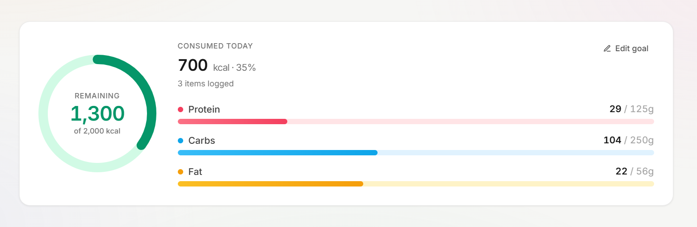
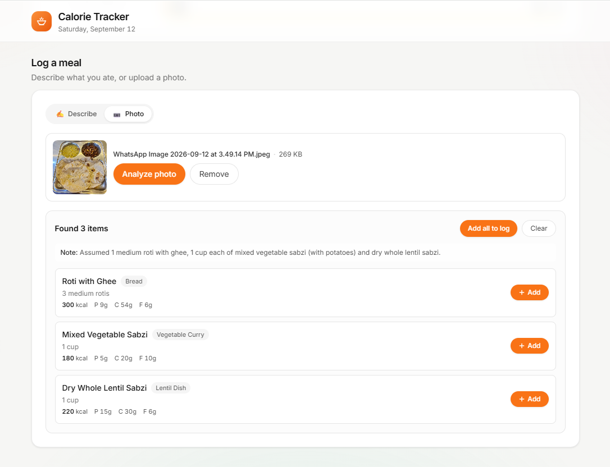

# Alok

Developer currently based in Bengaluru. I build web applications and data tools — mostly Python on the backend, with a background in computer networking.

I like projects where the hard part is getting something correct and keeping it live, not just getting it to render once.

---

## Selected work

### [Zencrest Realty](https://zencrestrealty.com) — client website
A marketing site for a Bengaluru real-estate firm, built and shipped end to end.

- **Astro + Tailwind CSS 4**, deployed on **Cloudflare Workers**
- Zero client-side JavaScript in the build output — the site is static HTML and CSS
- All copy lives in a typed `content.json`, so the client can request changes without touching markup
- Contact form via Web3Forms, delivering to a shared mailbox; tested live end to end
- Custom domain with www → apex redirect, canonical URLs, OG/Twitter metadata, sitemap and robots
- WCAG AA contrast pass across the palette

Beyond the code: domain registration, DNS, business email setup, and a post-launch change round with the client.

**Repo:** [zen-crest-realty](https://github.com/alokday007/zen-crest-realty)

---

### [food-price-intel](https://github.com/alokday007/food-price-intel) — food price forecasting *(paused)*
A forecasting service built on the FAO Food Price Index.

- **Django + PostgreSQL**, containerised, deployed on Render with a Neon database
- Ingestion pipeline for FAO FFPI data into a catalog/prices schema
- **Walk-forward validation harness** — models are scored the way they'd actually be used, not on a single holdout
- SARIMA(1,1,1)(1,1,1,12) forecasts that beat a naive-1 baseline at one-month horizon
- Forecasts persisted to their own tables, exposed over a JSON API and charted with Plotly.js

Currently paused. The deployed app forecasts from the last ingested FAO release, so the horizon trails the present date. The next step is generalising the forecasting pipeline across all six commodity group series.

---

### [cric-metrics](https://github.com/alokday007/cric-metrics) — cricket analytics dashboard
Interactive ball-by-ball statistics for IPL 2026.

- **Python, pandas, Plotly, Streamlit**
- Ball-by-ball data aggregated into per-player and per-match views

---

### Calorie Tracker — AI-assisted nutrition tracking for South Asian food *(private repo)*
A local-first calorie tracker built around Indian subcontinent cuisine, which mainstream trackers cover badly.

- **Next.js 14 (App Router), React 18, TypeScript (strict), Tailwind CSS**
- **Multimodal AI logging** — describe a meal in plain English or photograph it; `gemini-2.5-flash` returns per-item nutrition against a JSON schema, with its assumptions stated.
- AI runs behind two server routes, so the API key never reaches the browser
- Nothing enters the log until the user confirms from a preview — the model suggests, the user decides
- **No backend, no accounts, no cloud sync.** The log lives in `localStorage` under versioned keys; entries snapshot the food they were logged against, so catalog edits never rewrite past days
- Searchable catalog of 25 everyday foods with full macros; meal grouping auto-assigned by time of day and reassignable
- Reduced-motion support, focus-visible rings, tabular numerals, empty and error states on every async path
- 97 kB first-load JS, clean `tsc --noEmit` and production build

*Source is private. Happy to walk through the code or the architecture on request.*

---

### [namma-metro-fare-calculator](https://github.com/alokday007/namma-metro-fare-calculator) — fare lookup for Bengaluru's metro
A small Flask app that computes fares between any two stations on the Namma Metro network.

- **Flask**, deployed on Render
- My first substantial web project

---

## Tools

**Languages** Python, TypeScript, JavaScript, SQL, HTML/CSS
**Backend** Django, Flask, Next.js API routes, PostgreSQL
**Frontend** React, Next.js, Astro, Tailwind CSS, Plotly.js
**Data** pandas, statsmodels, Streamlit
**AI** Gemini API (text + vision), structured JSON output
**Infra** Docker, Cloudflare Workers, Render, Neon, Vercel, Git

---

## How I work

I build in scoped phases with a written definition of done for each one, commit atomically, and verify what's actually deployed rather than assuming it. Most of the time that means checking the built output, the network tab, and the live URL before calling something finished.

---

## Contact

Open to freelance work.

- Email: alok.day.aus@gmail.com
